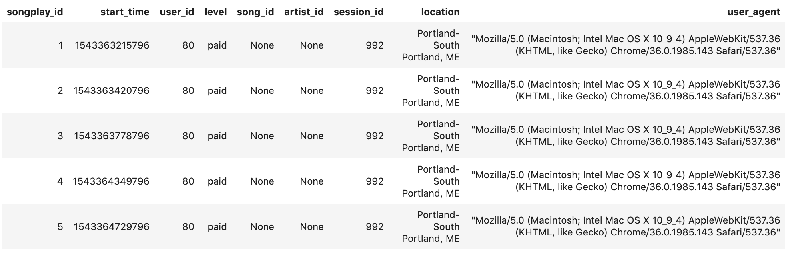
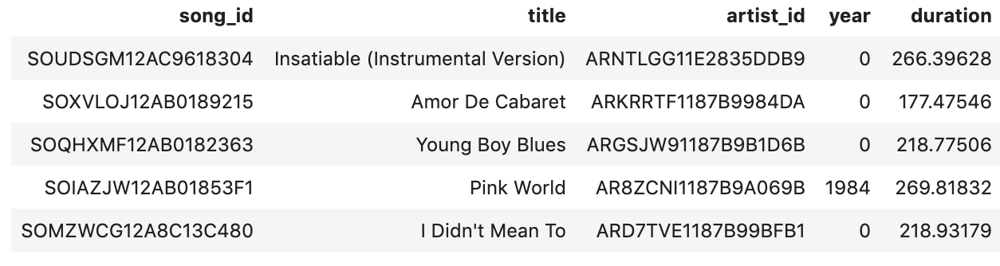
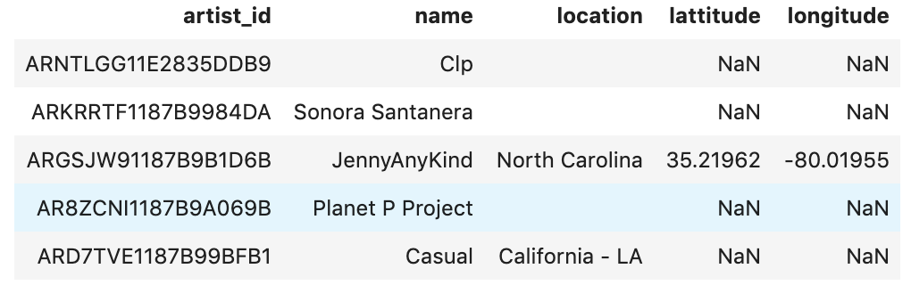
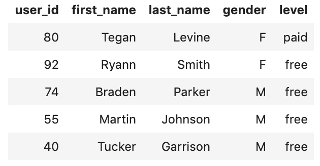
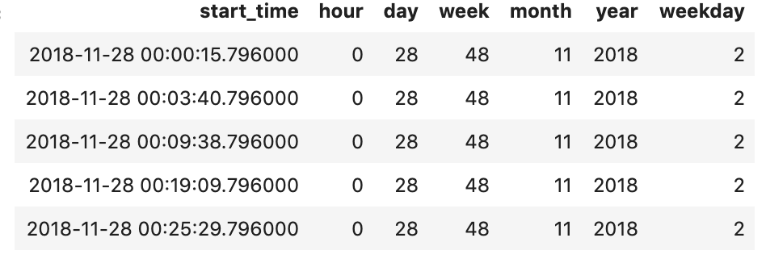

# Udacity Data Engineering Project 1: Data Modelling with PostgreSQL

## Datasets
There are two datasets being used in this project. The first is song metadata stored in data/song_data. This includes information about a song including who its artist is, how long the song is and information about the artist who created it including their name and location. These files are stored as JSON. An example is below:
```json
{"num_songs": 1, "artist_id": "ARJIE2Y1187B994AB7", "artist_latitude": null, "artist_longitude": null, "artist_location": "", "artist_name": "Line Renaud", "song_id": "SOUPIRU12A6D4FA1E1", "title": "Der Kleine Dompfaff", "duration": 152.92036, "year": 0}
```

The other dataset is log data stored in data/log_data. These files are stored as JSON and include information about user activity for every session within the app. This includes information such as the userAgent used to access the app, the user's name, location, and what songs they have listened to. Each log file represents 1 day of user activity within the app.


## Setup
The files in this repo are as follows:
* data/song_data: Metadata about the songs in sparkify
* data/log_data: logging information regarding user activity within the sparify app
* etl.ipynb: jupyter noteback that outlines my development process for the etl pipeline
* test.ipynb: jupyter notebook that provides testing utilities for database verification
* create_tables.py: python script to create the sparkify database or reset it
* etl.py: python script to extract the JSON data, transform it for easier analysis and insert it into the sparkify PostgreSQL database.
* sql_queries.py: utilities file containing the PostgreSQL queries that will be used to interact with the sparkify database.

### How to run this project:
1. Run the create_tables.py script to reset the database or create it if it does not exist:
```bash
python create_tables.py
```
2. Run the etl.py script to extra the data from data/song_data & data/log_data, transform it and load it into the postgreSQL database set up in step 1:
```bash
python etl.py
```
3. Open and run the test.ipynb notebook to ensure the data was loaded correctly


## Song Plays Data Mart
The purpose of this data mart is to provide utilize the data collected at Sparkify on songs and user activity to provide insights into how the streaming application is currently being used. This document will outline the data mart schema design and processing pipeline

## Schema Design
The data mart is organized as a star schema with user activity related to song plays as the fact table. This is because the primary goal was to optimize queries related to song plays as that is what the analytics team is primarily interested in. Right now, the analytics team is finding they are wasting a lot of time sorting through the user activity logs when they are just stored as JSON and need a more efficient way to gather business intelligence from the data regarding both the users activity and information about the songs themselves. 

This star schema design minimizes the amount of joins needed to query the data. This will make gathering useful insights from the data, and by extension acting on it, much faster.

There is 1 fact table (song_plays) and 4 dimension tables(users,artists,songs,time). The song_plays table is connected to the dimension tables for quick analytics that require more detailed information along a given dimension. The table descriptions are as follows:

**songplays:** songplay_id, start_time, user_id, level, song_id, artist_id, session_id, location, user_agent
* activity events from the log data that tracks whenever a user plays a song
**users:** user_id, first_name, last_name, gender, level
* detailed user information including what membership they have
**songs:** song_id, title, artist_id, year, duration
* detailed song information
**artists:** artist_id, name, location, lattitude, longitude
* detailed artist information
**time:** start_time, hour, day, week, month, year, weekday
* detailed temporal breakdown regarding song_play time stamps

## ETL Pipeline
The ETL pipeline I built extracts the JSON song metadata and user activity logs and constructs the star schema described above. The process is as follows:
1. Set up a connection to the sparkify database
2. Get all of the filepaths inside the data/song_data and data/log_data folders
3. For all of the data in the song_data folder, parse the JSON of each song and store the data into a songs table and an artists table
4. For all of the data in the log_data folder, parse the JSON of each log and the seperate the information as follows
    a. store activity event informaton in a song_plays fact table
    b. store detailed user information in a users dimension table
    c. store detailed start time information in a time table, (this makes searching by specific time periods of interest much easier)
    
When the etl script is run it will inform you of how many files were found and the status of processing them.

This was done so that the only thing the analytics team needs to do to ensure the ETL script works is ensure their logs and song metadata get stored in data/log_data and data/song_data respectivley. Since that is the existing structure of this repo, no changes are needed.

The resulting tables should look as follows:

## Song Plays Table


## Songs Table


## Artists Table


## Users Table


## Time Table


